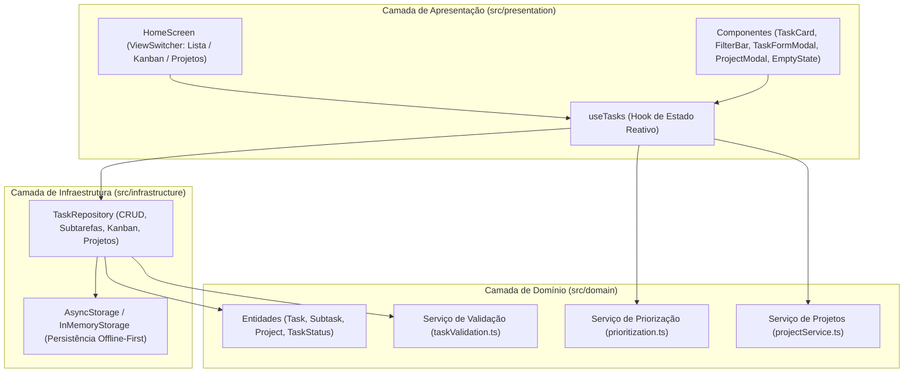
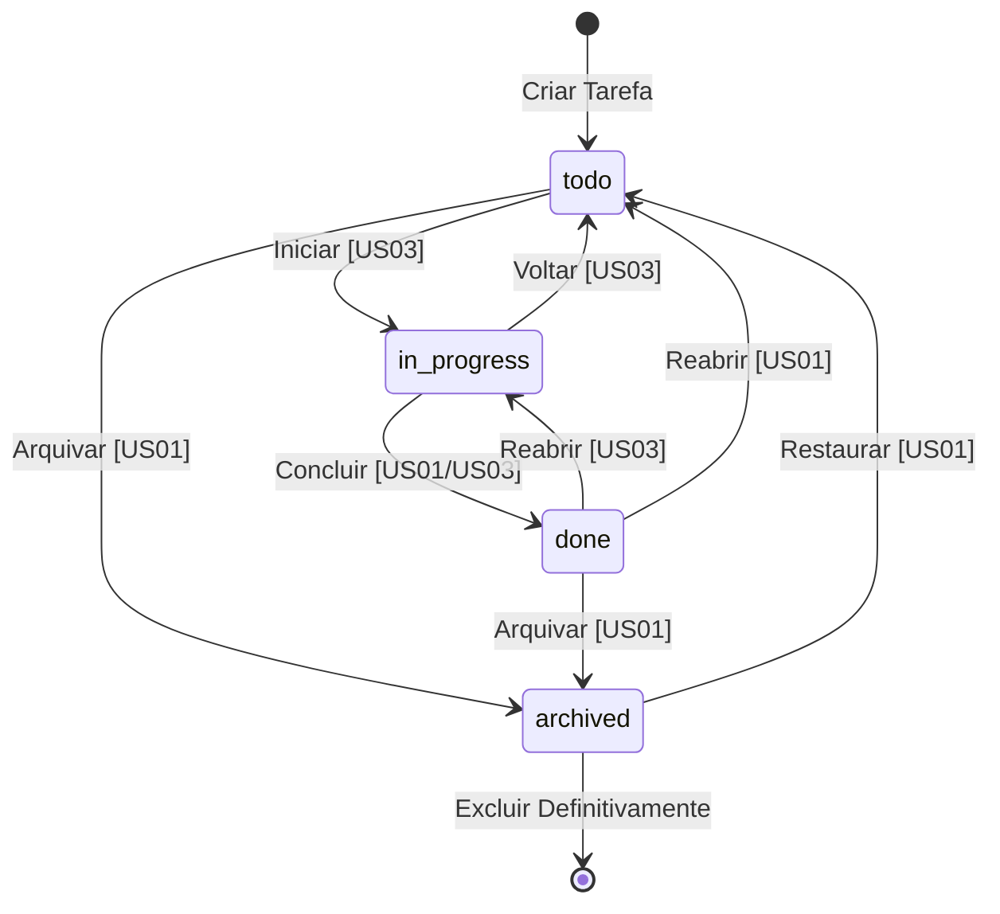

# Arquitetura - Grimório

## 1. Objetivo e Visão

O Grimório é um aplicativo Android/multiplataforma offline-first desenvolvido com React Native, Expo e TypeScript. A arquitetura foi desenhada segundo os princípios da Clean Architecture (Arquitetura Limpa), garantindo que as regras de negócio centrais permaneçam puras, determinísticas e totalmente desacopladas de frameworks de UI ou dependências externas.

---

## 2. Diagrama de Camadas da Aplicação

---

## 3. Detalhamento das Camadas

### 3.1. Camada de Domínio (`src/domain`)
Regras puras em TypeScript, sem nenhuma dependência do React ou Expo:
- **`entities/task.ts`**:
  - `Task`: modelo principal com título, descrição, prazo (`dueDate`, `dueTime`), prioridade, categoria, esforço estimado (`estimatedMinutes`), status (`todo` | `in_progress` | `done`), `projectId`, `subtasks` e timestamps.
  - `Subtask`: decomposição com `id`, `title`, `completed`, `createdAt`.
  - `Project`: agrupamento temático com `id`, `name`, `description`, `color`, `icon`.
  - `ProjectProgress`: métricas visuais contendo `totalTasks`, `completedTasks`, `progressPercent`.
  - DTOs: `CreateTaskDTO`, `UpdateTaskDTO`, `CreateProjectDTO`, `SubtaskInputDTO`.
- **`services/taskValidation.ts`**:
  - Validação estrita de datas (AAAA-MM-DD), horários (HH:MM), título obrigatório, limites de caracteres e valores numéricos válidos.
  - `validateCreateProjectInput`: validação de nomes e descrições de projetos.
- **`services/prioritization.ts`**:
  - Algoritmo determinístico de cálculo de urgência e pontuação (0 a 100 pontos) baseado em prazos, prioridade e tempo estimado.
- **`services/projectService.ts`**:
  - `calculateProjectProgress`: cálculo puro da porcentagem de conclusão de projetos.
  - `getAllProjectsProgress`: agregação em lote para todos os projetos ativos.

### 3.2. Camada de Infraestrutura (`src/infrastructure`)
- **`repositories/taskRepository.ts`**:
  - Implementa persistência offline-first utilizando `@react-native-async-storage/async-storage` com cache em memória síncrono para respostas instantâneas.
  - Suporta injeção de dependência de `IStorage`, permitindo 100% de isolamento em testes unitários.
  - Operações de Subtarefas (US02): `addSubtask`, `toggleSubtask`, `removeSubtask`.
  - Máquina de Estados Kanban (US03): `moveTaskKanban(id, newStatus)` gerenciando timestamps de conclusão (`completedAt`).
  - Gestão de Projetos (US04): `getProjects`, `createProject`, `deleteProject` (com desvinculação segura das tarefas associadas).

### 3.3. Camada de Apresentação (`src/presentation`)
- **`screens/HomeScreen.tsx`**:
  - Controla o seletor de visualização (`viewMode`: `'list' | 'kanban' | 'projects'`).
  - View Lista (US01 & US02): rituais do dia, filtros dinâmicos, cards expansíveis com subtarefas.
  - View Kanban (US03): 3 colunas de status com transições táteis diretas nos cards e layout responsivo.
  - View Projetos (US04): cards de projetos com barras de progresso visual, contadores e lista expansível de tarefas.
- **`components/`**:
  - `TaskCard.tsx`: card de tarefa com indicador de projeto, badge de pontuação, checklist de subtarefas expansível e botões de transição Kanban.
  - `FilterBar.tsx`: filtros rápidos por status, categoria, prioridade e projeto sem emojis do sistema operacional.
  - `TaskFormModal.tsx`: formulário modal completo com seletor de projeto e checklist builder.
  - `ProjectModal.tsx`: modal para criação de novos projetos com paleta de cores e ícones arcanos.
  - `PriorityScoreBadge.tsx`: detalhamento dos fatores matemáticos calculados para a sugestão de prioridade.
  - `ArchivedTasksModal.tsx`: arquivo sagrado com restauração e exclusão permanente.
- **`theme/colors.ts`**:
  - Paleta arcana: pergaminho (`#f6f1e8`), ameixa (`#403243`), dourado (`#c38b32`), sálvia (`#778b72`), tinta (`#25221d`).

---

## 4. Máquina de Estados de Tarefas (Kanban)

---

## 5. Estratégia de Testes

A suíte de testes é executada com o test runner nativo do Node.js (`node:test` e `node:assert`) sem dependências pesadas de terceiros:
- `tests/domain/taskValidation.test.ts`: validações de limites, datas, horas e campos obrigatórios.
- `tests/domain/prioritization.test.ts`: determinismo e coerência da pontuação matemática de prioridade.
- `tests/domain/taskFiltering.test.ts`: isolamento de filtros por status, prioridade e categorias.
- `tests/domain/subtasks.test.ts`: ciclo de vida completo de subtarefas e checklists.
- `tests/domain/kanban.test.ts`: transições de status e particionamento de colunas.
- `tests/domain/projects.test.ts`: cálculo de métricas de progresso e desvinculação em cascata.
- `tests/infrastructure/taskRepository.test.ts`: persistência local e CRUD completo.

**Total de testes:** 19 testes automatizados com 100% de aprovação.
