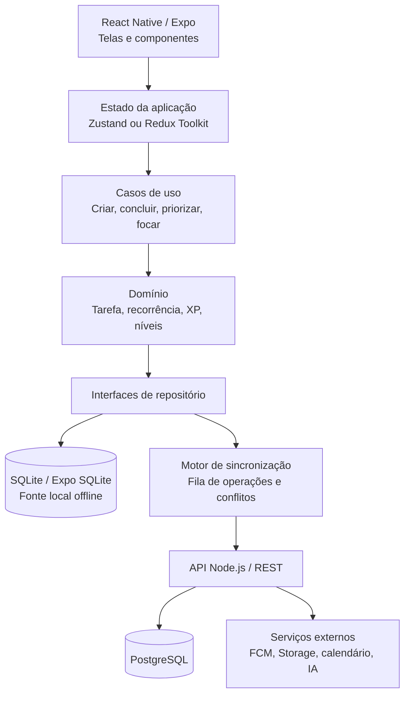
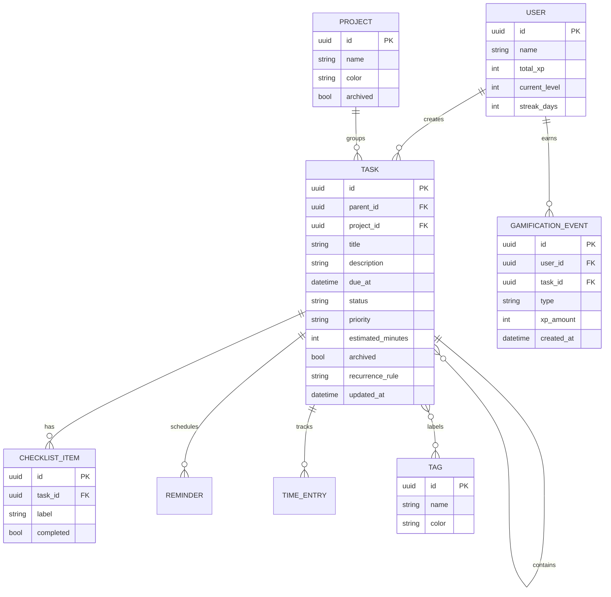

# Arquitetura - Grimório

## 1. Objetivo

A arquitetura foi pensada para um aplicativo Android offline-first, com uma base simples para a atividade e espaço para evoluir para colaboração, notificações e inteligência de planejamento sem acoplar a interface diretamente ao backend.

O protótipo atual usa Expo, React Native e TypeScript. A implementação completa deve preservar esse stack e separar apresentação, regras de negócio e persistência.

## 2. Visão geral



## 3. Camadas

### Apresentação

Responsável apenas por renderizar estado e emitir ações do usuário.

- `src/screens`: Dashboard, tarefas, Kanban, calendário, foco, histórico e perfil.
- `src/components`: TaskCard, ProgressRing, XpBadge, StreakCard, TaskForm e filtros.
- `src/navigation`: navegação por abas e pilhas de telas.
- `src/theme`: cores, tipografia, espaçamentos e tokens do tema arcano.

A tela não deve calcular XP, próxima ocorrência ou pontuação de prioridade. Ela chama um caso de uso e exibe o resultado.

### Aplicação

Orquestra os fluxos do produto e coordena estado, domínio e repositórios.

- `createTask`
- `completeTask`
- `updateTaskStatus`
- `suggestTaskOrder`
- `generateNextRecurrence`
- `startFocusSession`
- `recordCompletionFeedback`
- `syncPendingChanges`

### Domínio

Contém regras puras, testáveis e independentes de React ou Expo.

- `Task`: título, descrição, prazo, prioridade, esforço, status, recorrência e vínculos.
- `Subtask` e `ChecklistItem`: decomposição e progresso interno.
- `Project` e `Tag`: agrupamento e filtragem.
- `RecurrenceRule`: periodicidade e exceções.
- `PriorityScore`: urgência + importância + esforço + energia.
- `GamificationProfile`: XP, nível, sequência, missões e medalhas.

### Infraestrutura

Implementa os contratos definidos pela aplicação.

- `SQLiteTaskRepository`: persistência local.
- `ApiTaskRepository`: comunicação com o backend.
- `SyncQueue`: operações pendentes quando offline.
- `NotificationService`: lembretes locais e FCM em etapa posterior.
- `AttachmentService`: documentos, imagens e áudio em etapa posterior.

## 4. Modelo de dados inicial



## 5. Fluxo offline-first

1. A tela envia uma ação para um caso de uso.
2. O caso de uso valida os dados e aplica a regra de domínio.
3. A alteração é gravada imediatamente no SQLite.
4. Uma operação é adicionada à fila local com `operationId`, entidade, versão e payload.
5. A interface atualiza por observação do estado local, sem esperar a internet.
6. Ao detectar conexão, o sincronizador envia a fila para a API.
7. O servidor responde com a versão canônica.
8. Em conflito, vence a versão mais recente por entidade no MVP; conflitos colaborativos exigem estratégia posterior por campo.
9. A operação confirmada é removida da fila.

## 6. Priorização automática

A ordem sugerida deve ser explicável e determinística no MVP. Uma pontuação inicial pode ser:

$$
score = 0.45 \times urgencia + 0.30 \times importancia + 0.15 \times energia + 0.10 \times contexto
$$

- `urgencia`: cresce conforme o prazo se aproxima ou está atrasado.
- `importancia`: prioridade definida pelo usuário.
- `energia`: compatibilidade entre esforço da tarefa e energia estimada do usuário.
- `contexto`: dependências desbloqueadas, projeto atual ou sessão de foco.

A função deve retornar score e fatores usados, para que a sugestão possa ser explicada ao usuário.

## 7. Gamificação como diferencial

A gamificação é uma camada de domínio, não apenas decoração da tela.

- Concluir tarefa gera um `GamificationEvent` idempotente.
- XP varia por prioridade, esforço e cumprimento do prazo.
- O nível é calculado por uma tabela de progressão versionada.
- Sequência diária considera o fuso horário do usuário.
- Missões são objetivos compostos, como “concluir 3 tarefas”.
- Medalhas têm critérios verificáveis e não podem ser concedidas duas vezes.
- Desfazer uma conclusão gera um evento de reversão, evitando XP duplicado.

## 8. Backend futuro

Quando o MVP local estiver estável, o backend Node.js pode ser adicionado com:

- API REST versionada (`/v1/tasks`, `/v1/projects`, `/v1/sync`).
- Autenticação por JWT e refresh token.
- PostgreSQL para dados relacionais.
- Redis ou fila gerenciada para notificações e tarefas assíncronas.
- Firebase Cloud Messaging para push.
- Storage compatível com S3 para anexos e backup criptografado.
- Logs estruturados, validação de payload e controle de permissões por projeto.

## 9. Segurança e qualidade

- Não armazenar tokens em texto puro; usar armazenamento seguro do dispositivo.
- Validar dados no cliente e novamente no servidor.
- Aplicar princípio do menor privilégio em colaboração e anexos.
- Criptografar tráfego com HTTPS e dados sensíveis em repouso.
- Testar especialmente recorrência, fuso horário, idempotência de XP, fila offline e conflitos.
- Solicitar permissões Android somente no momento em que o recurso for usado.

## 10. Estrutura sugerida

```text
src/
  application/
    useCases/
    ports/
  domain/
    entities/
    services/
    rules/
  infrastructure/
    database/
    repositories/
    sync/
    notifications/
  presentation/
    components/
    navigation/
    screens/
    theme/
  store/
  shared/
    types/
    utils/
```

O `App.tsx` atual é um protótipo visual. A primeira refatoração da Sprint 1 deve mover a lista inicial e as operações de tarefa para `src/domain`, `src/store` e `src/presentation`, preservando a aparência já criada.
